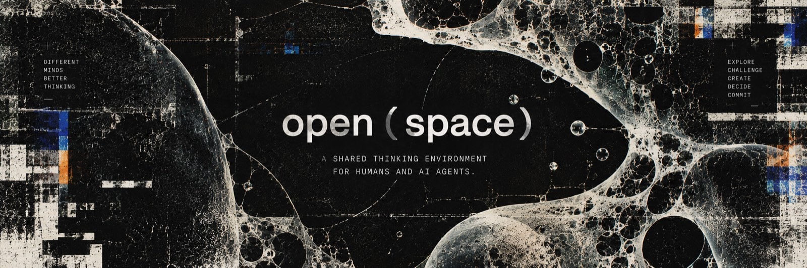

**Русский** · [English](README.en.md)

# `open(space)`

**Среда совместного мышления для человека и ИИ-агентов.**



[Концепция](docs/concept.md) · [Устройство](docs/architecture.md) · [На чём стоит](docs/dynamics.md) · [Что доделать](docs/todo.md) · [English](README.en.md)

`node >=20` · движки: `claude`, `codex` · `npm test` — 17 тестов

Не чат с несколькими моделями. Пространство под задачу: приглашаешь нужные умы, определяешь,
как именно они должны работать вместе, и разговор оставляет после себя не только переписку.

```text
open(product_strategy)
research(market)
redteam(pricing)
brainstorm(naming)
premortem(launch)
```

Они исследуют независимо, спорят, проверяют аргументы друг друга и собирают решение. Решает
человек.

```bash
git clone https://github.com/gh0stcreator/openspace && cd openspace
cd web && npm install && cd ..
npm run dev            # localhost:4477
```

Нужны установленные и авторизованные `claude` и `codex` — своих ключей продукт не просит.

---

## Манифест

Большинство ИИ-продуктов сегодня устроено вокруг разговора с одним универсальным интеллектом.

Открываешь чат. Задаёшь вопрос. Получаешь ответ. Уточняешь. Закрываешь вкладку.

Для многих задач этого достаточно. Для сложной работы — нет.

Стратегия, продукт, исследование, текст и разбор решений редко требуют одного правильного
ответа. Им нужны разные способы мышления: исследовать, придумать, усомниться, атаковать
аргумент, найти противоречие, сравнить варианты и принять решение.

Главная гипотеза продукта:

> **Команда специализированных агентов, работающая в явно заданном процессе и общем
> накопленном контексте, позволяет человеку решать сложные задачи лучше, чем разговор
> с одним универсальным ИИ.**

Внутри неё три отдельные ставки.

| Ставка | Против чего |
| --- | --- |
| **Team > Agent** | один универсальный помощник |
| **Process > Free chat** | свободная переписка |
| **Persistent Space > Disposable conversation** | одноразовый тред |

### Team > Agent

Не потому, что пять агентов автоматически умнее одного.

Потому что разные независимые способы смотреть на задачу дают то, чего не даёт один
последовательный контекст: другую информацию, другую рамку и настоящее расхождение, которое
видно и можно разобрать.

### Process > Free chat

Хорошая команда сама по себе ещё ничего не гарантирует.

Иногда участники должны слышать друг друга. Иногда — сначала думать независимо. Иногда один
должен атаковать аргументы другого. Иногда решение нельзя принимать, пока не сформулирована
проблема.

Поэтому способ совместной работы — часть среды, а не инструкция внутри очередного промпта.

### Persistent Space > Disposable conversation

Самая ценная часть сложной работы — не транскрипт. Это решения, предположения, найденные
факты, ограничения и открытые вопросы.

Они не должны исчезать вместе с закончившимся чатом. Сегодня пространство держит разговор,
состав команды, режимы и общую цель; структурированная память — следующий этап, о нём ниже.

**Разговор заканчивается. Пространство остаётся.**

---

## Почему мультиагентность обычно не работает

Главный риск таких систем — **multi-agent theatre**.

Пять голосов по очереди пересказывают одну мысль, вежливо соглашаются друг с другом и в конце
делают summary. Это дороже одного хорошего запроса, но не обязательно умнее.

Поэтому ценность берётся не из количества говорящих, а из устройства мышления:

```text
independent exploration
        ↓
different information
        ↓
real disagreement
        ↓
challenge
        ↓
synthesis
        ↓
human decision
        ↓
commit
```

Критический элемент — **independent exploration**.

Если агенты сразу видят ответы друг друга, первый ответ становится якорем, и несколько
интеллектов быстро превращаются в несколько способов согласиться с первым.

Поэтому шаг режима может идти с `hear: нет`: все участники шага получают ленту до одной и той
же отметки и отвечают, не видя ответов соседей. Сначала позиции, потом столкновение.

---

## Как это выглядит

Премортем на пустой комнате: тема — и команда идёт по шагам, а не отвечает вразнобой.

```text
Roman
Через неделю выкатываем мегаменю на весь трафик.

premortem(megamenu) · 1/4 · Похороны · вслепую
Академик, Скептик и Инженер отвечают, не видя ответов друг друга

Скептик
Прошло полгода. Меню выкатили, конверсия в запись упала на 4%.
Причина: на мобильном второй уровень открывается тем же тапом…

Инженер
Провалились иначе: дерево категорий собирается на клиенте,
на медленных телефонах первый экран ждёт 900 мс…

premortem(megamenu) · 2/4 · Вскрытие
Roman
Второе важнее. Сколько это стоит проверить?
```

Шаг вслепую — не украшение: участники получают ленту до одной и той же отметки, поэтому
первый ответ не задаёт остальным рамку. Реплика человека в любой момент останавливает
очередь: отвечают на неё, а не на то, что было до.

## На чём это стоит

Режимы собраны не по вкусу. Ниже — то, на что они опираются, с числами и ссылками.
Подробный разбор с метками доказанности, включая работы, которые **не** подтверждают
популярные представления, — в [`docs/dynamics.md`](docs/dynamics.md).

**Сначала порознь, потом вместе.** Мета-анализ 65 исследований и 3189 групп: в обсуждении
общеизвестное упоминается примерно на 2 SD чаще уникального, а группы, где важное знал
кто-то один, находят решение в 8 раз реже ([Lu, Yuan, McLeod
2012](https://journals.sagepub.com/doi/abs/10.1177/1088868311417243)). Отсюда шаг с `hear: нет`.

**Расхождение важнее правоты.** Группы с разными стартовыми позициями решали задачу значимо
чаще — даже когда ни одна из позиций не была верной ([Schulz-Hardt и др.
2006](https://www.semanticscholar.org/paper/679ba16b7a51e1c0bbd53e900c22820b4aadcbfe),
135 групп). Отсюда шаг «Позиция» до всякого разбора.

**Назначенный скептик работает хуже настоящего.** Адвокат дьявола по должности заставляет
остальных укрепиться в своём ([Nemeth, Brown, Rogers
2001](https://onlinelibrary.wiley.com/doi/abs/10.1002/ejsp.58)). Поэтому расхождение берётся
устройством — другой движок, свой контекст, — а не строчкой «возражай» в промпте.

**Трое не хуже шестерых.** Группы из 3, 4 и 5 обходят лучшего из стольких же одиночек,
но 4 и 5 не лучше 3 ([Laughlin и др. 2006](https://pubmed.ncbi.nlm.nih.gov/16649860/)).
Размер помогает только там, где верный ответ узнают, увидев его ([Amir и др.
2018](https://journals.plos.org/plosone/article?id=10.1371/journal.pone.0192213)).
Отсюда состав режима в 3–4 участника, а не «все».

**Спор агентов сам по себе не окупается.** На 5 методах, 9 бенчмарках и 4 моделях дебат часто
проигрывает одиночному chain-of-thought при кратно большем расходе; помогает **разнородность
моделей** ([Zhang и др. 2025](https://arxiv.org/abs/2502.08788)). Агенты вдобавок конформны
([Zhang и др., ACL 2024](https://aclanthology.org/2024.acl-long.782/)), а неверный сосед сбивает
верную модель легче, чем верный исправляет неверную ([Qu, Fu, Hu
2026](https://arxiv.org/abs/2606.01637)). Поэтому движка два, а не один.

**Человек — самый сильный якорь в комнате.** Угодливость встроена в предпочтения RLHF
([Sharma и др. 2023](https://arxiv.org/abs/2310.13548)), поэтому в промпте участника стоит
отдельный запрет подстраиваться под формулировку человека.

Чего в литературе нет: подтверждения, что «Шесть шляп» работают как целый метод, и что
премортем «находит на 30% больше рисков» — подтверждён другой его эффект, снижение
уверенности в плане ([Veinott, Klein, Wiggins
2010](https://idl.iscram.org/files/veinott/2010/1049_Veinott_etal2010.pdf)).

## `mode(subject)`

Название продукта — это и есть его интерфейс. **Open space** — общая комната, где
разговаривают; **`open(space)`** — вызов функции: открыть пространство.

Знак в шапке показывает, где ты: слева — как сейчас думаем, в скобках — о чём.

```text
open(space)               ещё ничего не начато
open(product_strategy)    разговор без регламента, тема названа
sixhats(megamenu)         разбираем вопрос по кругам
premortem(launch)         ищем, как это провалится
```

## Какой режим выбрать

| Ситуация | Режим |
| --- | --- |
| Решение принято, и оно дорого меняется | Стратсессия |
| План есть, уверенность в нём высока | Премортем |
| Решение готово, надо найти, где сломается | Красная команда |
| Очевидное не годится, нужны ходы | Мозговой штурм |
| Вопрос сложный, спор ходит по кругу | Шесть шляп |
| Просто разговор | Открытый |

Режим включается в строке под полем ввода или прямо на пустом экране. В пустой комнате он ждёт
первой темы: шаги нужны разговору о чём-то.

## Решает человек

`open(space)` не пытается заменить человека коллективом агентов. Агенты исследуют, спорят,
критикуют и синтезируют. **Решение остаётся за человеком.**

Следующий шаг продукта — превратить это в явную операцию, похожую на git. Когда что-то
действительно стало частью понимания задачи, среда предлагает изменение общего контекста:

```diff
+ decision: keep Select inside the core product
+ assumption: premium demand is sufficiently distinct
+ open_question: pricing elasticity
```

Человек решает, что оставить.

```text
commit
```

**Этого пока нет.** `/remember`, diff и `commit` — этап `0.4`, ради которого всё и строится.
Сегодня сохраняется сам разговор, а модель задачи живёт в общей цели и в памяти участников.

---

## Локально

Сам `open(space)` работает на твоей машине: сервер, лента, файлы ролей и режимов. Модели — нет.
Он запускает установленные и авторизованные `claude` и `codex` через их обычные CLI: отдельные
API-ключи и отдельная оплата по токенам для `open(space)` не нужны, а запросы уходят туда же,
куда уходят из этих CLI обычно.

```bash
npm run dev
```

Поднимает сервер и следит за `web/`: правка клиента собирается сама. Не трогаешь клиент —
хватит `node server.js`. Открыть: `http://localhost:4477`.

```bash
node server.js --port 4477 --workdir ../my-project --user roman
```

Рабочая папка — место, где участники читают и **правят** файлы, без подтверждений. По умолчанию
это сам репозиторий. Направляй её на проект, в котором готов увидеть чужие правки в `git diff`.

Первый запуск требует зависимостей клиента; сборка в `public/` не коммитится:

```bash
cd web && npm install
```

---

## Как идёт разговор

Участники не крутятся в автономном цикле — их будит обращение, и каждый получает только то, что
появилось с его прошлого хода.

- `@имя` адресует реплику конкретному участнику.
- Без тега отвечают дежурные, заданные текущим режимом.
- `[skip]` — законный ход: добавить нечего, лента не засоряется.
- В свободном разговоре после N реплик подряд без человека всё встаёт на паузу.
- `Esc` ставит на паузу; уже запущенный ответ не выбрасывается.

Движки, уровни доступа, экономия контекста и API — [`docs/architecture.md`](docs/architecture.md).

---

## Если что-то не работает

| Что видно | Что делать |
| --- | --- |
| Участник отвечает ошибкой про `claude` или `codex` | Движок не найден или не авторизован: проверь `claude -p ok` и `codex exec -` в терминале |
| Все молчат, лента стоит | Разговор на паузе — напиши что-нибудь, пауза снимется |
| Правка интерфейса не появляется | Нужен `npm run dev`: под `node server.js` клиент не пересобирается |
| Порт занят | `node server.js --port 4480` |
| `SPACE_DEBUG=1` | Печатает флаги, с которыми реально стартует каждый CLI |

## Модель продукта

```text
Space     = где            Agent   = кто
Skill     = что умеет      Context = что знает
Mode      = как работаем   Rule    = что нельзя
Memory    = что усвоили
```

| Сущность | Сейчас |
| --- | --- |
| **Space** | одна машина, комнаты по `?room=` |
| **Agent** | ник, роль, характер, движок, модель, доступ, аватарка |
| **Mode** | набор режимов и редактор к ним |
| **Rule** | частично: правила разговора и требования режима |
| **Context** | частично: общая цель разговора |
| **Memory** | написана, пока не подключена (`lib/memory.js`) |
| **Skill** | ещё нет |

Концепция и дорожная карта — [`docs/concept.md`](docs/concept.md).

## Статус

```text
0.1 Room       ██████████  done
0.2 People     ████████░░  almost
0.3 Modes      ██████░░░░  in progress
0.4 Memory     ██░░░░░░░░  next
0.5 Spaces     ░░░░░░░░░░
0.6 Physics    ░░░░░░░░░░
0.7 Skills     ░░░░░░░░░░
```

**Продукт становится по-настоящему собой на 0.4:** ты уходишь из комнаты, возвращаешься позже —
и она помнит, до чего вы здесь додумались.

---

## Настройки

Всё правится в интерфейсе, **Профиль → Настройки**, и применяется без перезапуска: участники
(кто здесь), режимы (как работаем) и пространство (зачем мы здесь и что помним). Редактор
режимов пишет те же файлы `modes/*.md`. На диске то же состояние описывает
`openspace.config.json`.

## Карта репозитория

| Путь | Что внутри |
| --- | --- |
| `AGENTS.md` | канон: дизайн-система, токены, DRY, язык интерфейса |
| `docs/handoff.md` | где проект сейчас и что дальше — читать первым |
| `docs/todo.md` | разбор кода и процесса: дефекты, устройство, хвосты |
| `docs/plan.md` | порядок работ по этому разбору |
| `docs/dynamics.md` | что известно про групповые решения: выжимка из литературы |
| `docs/concept.md` | концепция продукта и roadmap |
| `docs/architecture.md` | движки, доступ, экономия контекста, API |
| `roles/` | роли агентов |
| `modes/` | режимы работы |

---

**Открой пространство. Собери тех, кто нужен. Задай им способ думать вместе. Сохрани то,
до чего они дошли.**
