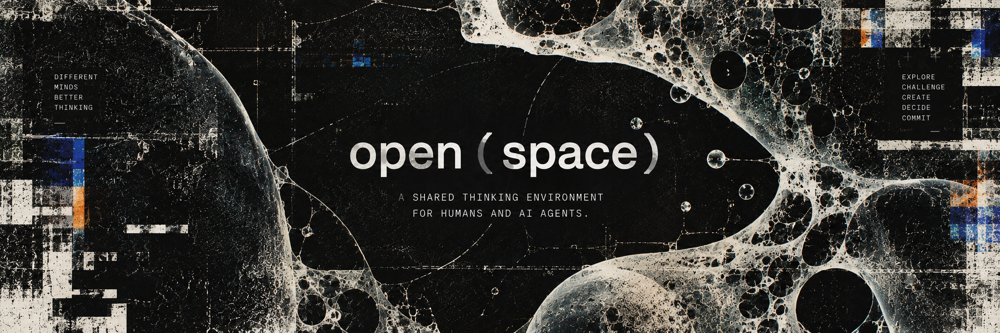

**Русский** · [English](README.en.md)

# `open(space)`

**A shared thinking environment for humans and AI agents.**

Среда, в которой человек собирает команду ИИ-агентов, задаёт ей способ работы и накапливает общий контекст задачи.

Не чат с несколькими моделями. **Пространство для совместного мышления.**

```text
open(product_strategy)
open(book)
open(launch)
open(brand)
open(career)
```

Открываешь пространство под задачу. Зовёшь нужные умы. Определяешь, как именно они должны работать вместе. Они исследуют независимо, спорят, проверяют аргументы и собирают решение.

А то, до чего вы вместе додумались, **остаётся в пространстве**.

---

## Manifesto

Большинство AI-продуктов сегодня устроено вокруг разговора с одним универсальным интеллектом.

Открываешь чат. Задаёшь вопрос. Получаешь ответ. Уточняешь. Закрываешь вкладку.

Для многих задач этого достаточно. Для сложной работы — нет.

Стратегия, продукт, исследование, текст и разбор решений редко требуют одного правильного ответа. Им нужны разные способы мышления: исследовать, придумать, усомниться, атаковать аргумент, найти противоречие, сравнить варианты и принять решение.

`open(space)` строится вокруг трёх ставок:

| Ставка | Против чего |
| --- | --- |
| **Team > Agent** | один универсальный помощник |
| **Process > Free chat** | свободная переписка |
| **Persistent Space > Disposable conversation** | одноразовый тред |

### Team > Agent

Не просить один универсальный интеллект одновременно быть исследователем, инженером, критиком и дизайнером.

Собрать несколько специализированных умов с разными ролями, контекстом и способами смотреть на задачу.

### Process > Free chat

Хорошая команда сама по себе ещё ничего не гарантирует.

Иногда участники должны слышать друг друга. Иногда — сначала думать независимо. Иногда один должен атаковать аргументы другого. Иногда решение нельзя принимать, пока не сформулирована проблема.

Поэтому способ совместной работы — часть среды, а не инструкция внутри очередного промпта.

### Persistent Space > Disposable conversation

Самая ценная часть сложной работы — не transcript.

Это решения, предположения, найденные факты, ограничения, открытые вопросы и то, что команда уже поняла о задаче.

Они не должны исчезать вместе с закончившимся чатом.

**Разговор заканчивается. Пространство остаётся.**

---

## The idea

Главная гипотеза `open(space)`:

> **Команда специализированных интеллектов, работающая в явно заданном процессе и общей накопленной модели задачи, позволяет человеку решать сложные задачи лучше, чем разговор с одним универсальным ИИ.**

Поэтому основной объект здесь — не сообщение, модель и даже не агент.

**Основной объект — Space.**

```text
Space     = где            Agent   = кто
Skill     = что умеет      Context = что знает
Mode      = как работаем   Rule    = что нельзя
Memory    = что усвоили
```

---

## `mode(topic)`

Название продукта одновременно является его интерфейсом.

```text
open(space)
```

**Open space** — общая комната, где разговаривают.  
**Outer space** — пустота и ощущение простора.  
**`open(space)`** — вызов функции: открыть пространство.

Логотип показывает текущее состояние продукта:

```text
open(product_strategy)
research(market)
brainstorm(positioning)
redteam(pricing)
decide(launch)
```

Слева — **как сейчас думаем**. В скобках — **о чём сейчас думаем**.

В idle это реальное состояние пространства. На hover обе части по очереди меняются, показывая грамматику продукта, после чего знак возвращается к актуальному состоянию.

---

## Не пять ботов в одном чате

Главный риск multi-agent систем — **multi-agent theatre**.

Пять голосов по очереди пересказывают одну мысль, вежливо соглашаются друг с другом и в конце делают summary. Это дороже одного хорошего запроса, но не обязательно умнее.

Поэтому ценность берётся не из количества говорящих, а из устройства мышления:

```text
independent exploration
        ↓
different information
        ↓
real disagreement
        ↓
challenge
        ↓
synthesis
        ↓
human decision
        ↓
commit
```

Критический элемент — **independent exploration**.

Если агенты сразу видят ответы друг друга, первый ответ становится якорем. Несколько интеллектов быстро превращаются в несколько способов согласиться с первым.

Поэтому шаг режима может выполняться с `hear: no`: участники получают одну и ту же исходную точку и отвечают независимо.

Сначала позиции. Потом столкновение.

---

## Human stays in the loop

`open(space)` не пытается заменить человека коллективом агентов.

Агенты могут исследовать, спорить, критиковать и синтезировать. **Решение остаётся за человеком.**

Когда что-то действительно стало частью понимания задачи, система предлагает изменение общего контекста:

```diff
+ decision: keep Select inside the core product
+ assumption: premium demand is sufficiently distinct
+ open_question: pricing elasticity
```

Человек решает, что оставить.

```text
commit
```

---

## Как это выглядит

```text
open(product_strategy)

roman:
Should Select become a separate product?

/mode strategy

researcher:
I'll examine willingness to pay, segmentation and comparable products.

skeptic:
I'll try to prove that separating Select destroys the core proposition.

strategist:
I'll model both portfolio architectures.

[ independent exploration ]

...

synthesis:
Three viable options remain...

roman:
Keep option B. We still need evidence for the pricing assumption.

/remember

+ decision: keep Select inside the core product
+ assumption: premium demand is sufficiently distinct
+ open_question: pricing elasticity

commit
```

---

## Local first

Всё работает локально, на своей машине и на своих подписках. Ключи и отдельная оплата по токенам не нужны: движки запускаются теми же CLI, которыми пользуешься сам.

Нужны установленные и залогиненные `claude` и `codex`.

```bash
npm run dev
```

Поднимает сервер и следит за `web/`: правка клиента собирается сама. Если клиент трогать
не собираешься — хватит `node server.js`.

Открыть:

```text
http://localhost:4477
```

Порт, рабочую папку и ник можно переопределить:

```bash
node server.js --port 4477 --workdir ../my-project --user roman
```

Рабочая папка — место, где участники читают и **правят** файлы, без подтверждений. По умолчанию
это сам репозиторий. Направляй её на проект, в котором готов увидеть чужие правки в `git diff`.

Первый запуск требует установки зависимостей клиента; сборка в `public/` не коммитится:

```bash
cd web && npm install
```

---

## Как работает разговор

Участники не крутятся в автономном цикле. Их будит обращение.

```text
человек → @скептик
              ↓
         ответ в ленту
              ↓
      в ответе есть @инженер
              ↓
         отвечает @инженер
```

Каждый агент получает только то, что появилось с его прошлого хода, а не весь тред заново.

Коротко о правилах:

- `@имя` адресует реплику конкретному участнику.
- Без тега отвечают дежурные, заданные текущим режимом.
- `[skip]` — законный ход: если добавить нечего, лента не засоряется.
- После N реплик подряд без человека разговор ставится на паузу.
- `Esc` ставит разговор на паузу; уже запущенный ответ не выбрасывается.

Подробности про движки, уровни доступа, экономию контекста и API — в [`docs/architecture.md`](docs/architecture.md).

---

## Модель продукта

| Сущность | Сейчас |
| --- | --- |
| **Space** | одна машина, комнаты по `?room=` |
| **Agent** | ник, роль, характер, движок, модель, доступ, аватарка |
| **Mode** | набор режимов + редактор |
| **Rule** | частично: правила разговора и требования режима |
| **Context** | частично: общая цель разговора |
| **Memory** | написана, пока не подключена (`lib/memory.js`) |
| **Skill** | ещё нет |

Подробная концепция и roadmap — [`docs/concept.md`](docs/concept.md).

---

## Status

```text
0.1 Room       ██████████  done
0.2 People     ████████░░  almost
0.3 Modes      ██████░░░░  in progress
0.4 Memory     ██░░░░░░░░  next
0.5 Spaces     ░░░░░░░░░░
0.6 Physics    ░░░░░░░░░░
0.7 Skills     ░░░░░░░░░░
```

**Продукт становится по-настоящему собой на 0.4:** ты уходишь из комнаты, возвращаешься позже — и она помнит, до чего вы здесь додумались.

---

## Настройка

Всё основное правится в интерфейсе через **Профиль → Настройки** и применяется без перезапуска.

**Участники** — кто здесь: ник, роль, задача, характер, движок, модель, доступ.  
**Режимы** — как работаем: шаги, участники, `hear`, условия завершения. Редактор пишет те же файлы `modes/*.md`.  
**Пространство** — зачем мы здесь, память участников и лента.

На диске то же состояние описывает `openspace.config.json`.

---

## Repository map

| Путь | Что внутри |
| --- | --- |
| `AGENTS.md` | канон: дизайн-система, токены, DRY, язык интерфейса |
| `docs/handoff.md` | где проект сейчас и что делать дальше — читать первым |
| `docs/todo.md` | разбор кода и процесса: дефекты, устройство, хвосты |
| `docs/plan.md` | порядок работ по этому разбору |
| `docs/concept.md` | концепция продукта и roadmap |
| `docs/architecture.md` | движки, доступ, экономия контекста, API |
| `docs/dynamics.md` | что известно про групповые решения: чем подкреплены режимы |
| `roles/` | роли агентов |
| `modes/` | режимы работы |

---

**Open a space. Bring the right minds. Give them a way to think together. Keep what they learn.**
